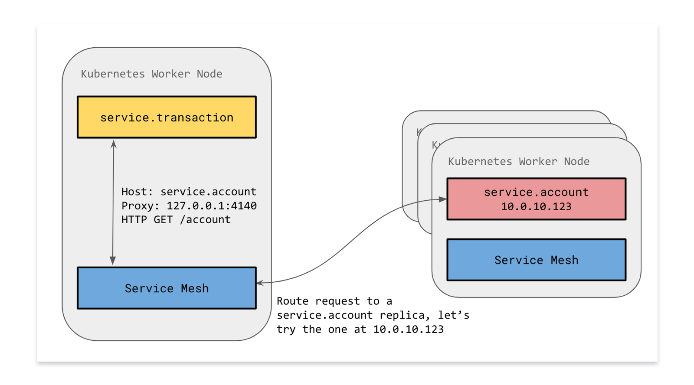
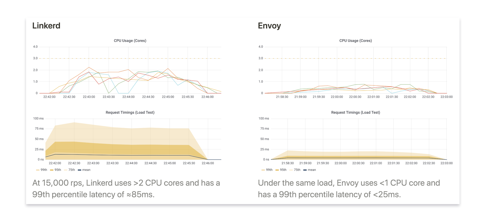
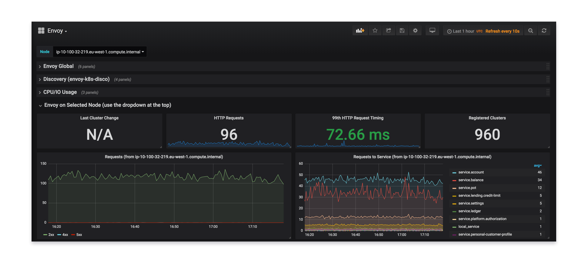
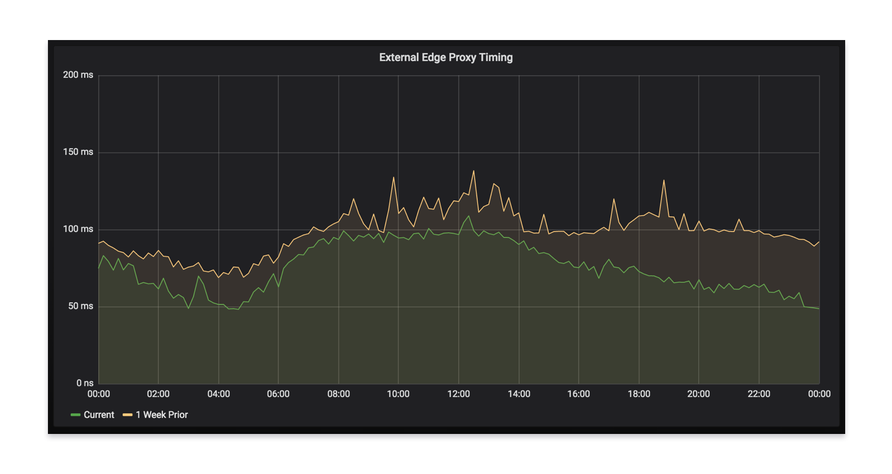
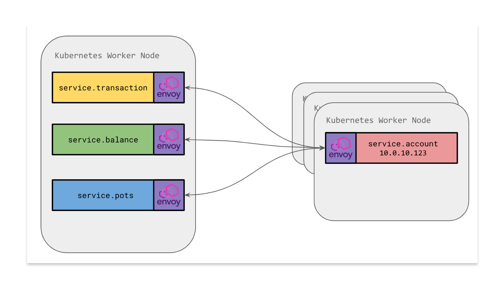

[编者按]

> 本文介绍了使用Envoy来加速Monzo，对比了使用Linkerd和Envoy，通过试验证明Envoy拥有更小的延迟。

我们基础设施的一个核心组件是远程过程调用(RPC)系统。它允许微服务通过网络以可伸缩和可容错的方式彼此通信。

每当评估RPC系统时，通常会查看以下几个关键指标：

- **高可用**，服务之间的通信应该尽可能快。RPC子系统应该做到延迟开销最小化，并在路由请求时避免路由到失败的服务副本。

- **可伸缩性**，平台每秒会收到数以万计的请求，随着用户基数的增长，这些请求的数量还在不断增加。所拥有的任何子系统都需要继续支持这种增长。

- **可恢复性**，当服务副本宕机、发生bug或者网络不可靠时。子系统应该能检测到不可用的下游和异常值，让系统收到反馈并绕过失败进行路由。

- **可观察性**，RPC子系统生成大量关于平台性能的数据。与现有的[度量标准和追踪基础设施](https://monzo.com/blog/2018/07/27/how-we-monitor-monzo/)集成，以在现有的服务度量标准和追踪的同时公开服务网格信息。

2016年，我们写了一篇关于[构建现代银行后台](https://monzo.com/blog/2016/09/19/building-a-modern-bank-backend/)的博客，其中一个关键部分是服务网格，它由[Linkerd 1.0](https://linkerd.io/1/overview/)提供支持。当我们在2016年选择Linkerd 1.0时，服务网格生态体系还比较年轻。

从那时起，许多新项目都追随了我们这个想法。我们想重新评估Linkerd 1.0是否适合我们的需求。

## 服务网格

我们的微服务每秒通过HTTP执行数万次RPC调用。然而，要建立一个可靠的、可容错的分布式系统，需要具有服务发现、自动重试、错误预算、负载均衡和熔断功能。

我们想建立一个支持所有编程语言的平台。虽然的大多数微服务都是用Go实现的，但是有些团队选择使用其他语言(例如，数据团队使用Python编写一些机器学习服务)。

在我们使用的每一种语言中实现这些复杂的特性，当想要使用新东西时，会面临非常高的门槛。此外，对RPC子系统的更改将意味着重新部署所有服务。

我们早期做出的一个关键决定是尽可能地使这个复杂的逻辑脱离流程：Linkerd对服务透明提供了许多特性。

我们运行Linkerd作为[Kubernetes Daemonset](https://kubernetes.io/docs/concepts/workloads/controllers/daemonset/)。这意味着每个服务将与每个节点上运行的Linkerd的本地服务副本通信。

## 迁移到Envoy

在我们为[众筹做准备](https://monzo.com/blog/2019/01/15/crowdfunding-technology-testing/)的过程中，我们发现Linkerd无法在不赋予它不成比例的处理能力的情况下处理负载。我们必须大规模扩展我们的基础设施来应对。随着我们业务需求的不断增长，运行RPC基础设施所需的资源数量是不可持续的。即使在正常的负载模式中，Linkerd本身也是造成第99百分位延迟的主要因素。

我们开始评估与RPC子系统标准相匹配的替代方案。我们研究了Linkerd 2.0、Istio和Envoy。我们最终选择了Envoy，因为它具有高性能、相对成熟和广泛应用于大型工程团队和项目的能力。

[Envoy](https://www.envoyproxy.io/)是一个开源的高性能服务网格，最初由Lyft开发。它是用C++编写的，因此不会受到垃圾收集的影响，也不会出现编译暂停。它是支撑Istio和Ambassador等其他一些项目的核心代理。

Envoy并没有对Kubernetes的任何依赖。我们编写了自己的小型控制平面，它将监视Kubernetes基础设施中的更改(例如由于新Pod而更改的端点)，并通过[集群发现服务](https://www.envoyproxy.io/docs/envoy/latest/configuration/cluster_manager/cds)(CDS) API将更改推送给Envoy，使其感知到新服务。

我们使用为测试众筹系统而开发的[负载测试工具](https://monzo.com/blog/2019/01/15/crowdfunding-technology-testing/)来测试现有的Linkerd和新的Envoy的性能。

在我们所有的测试中，Envoy都比我们现有的Linkerd 1.0表现得好得多，同时需要更少的处理能力和内存资源。

与Linkerd相比，Envoy缺少一些功能，比如延迟感知负载均衡(而不仅仅是轮询)和基于服务的错误预算(而不仅仅是基于每个请求的自动重试)。最终，我们没有发现这些是交易破坏者，尽管我们想在未来添加它们。

我们希望转换对服务是透明的。在我们的推出中，一个关键因素是如果需要回滚，该更改的可回溯性。

我们设置了Envoy来接受和路由HTTP上的请求，就像Linkerd一样，并以Kubernetes daemonset方式将其推出。在几个月的时间里，我们在预发布环境中大量测试了这些更改。一旦到了投入生产的时候，我们就会在几天的时间里逐步推出它，以发现并解决任何在最后一刻出现的问题。

## 可观察性

虽然Linkerd 1.0有一个很好的控制平面，但它不能很好地与基于Prometheus的监控系统集成。在Envoy投入生产之前，我们对其与Prometheus的融合给予了密切关注。

我们[回馈Envoy社区](https://github.com/envoyproxy/envoy/pulls?utf8=%E2%9C%93&q=is%3Apr+author%3Asuhailpatel+)，完成了对Prometheus的一级支持。这允许我们拥有丰富的仪表板来增强现有的服务度量。

通过拥有这些数据，我们对首次展示获得了信心，以确保它是无缝的和无错误的。

当你的应用程序与我们的后端通信时，它会经过我们的边缘层，然后启用不同数量的微服务(有时超过20个)来满足请求。当我们推出Envoy时，我们看到我们的边缘延迟减少了，这证实了我们的测试结果。这最终意味着，对于所有使用Monzo的人来说，都能获得更快的应用体验。

## Envoy作为sidecar

我们现在正在进行的一个关键项目是将服务移动到Envoy Proxy作为微服务容器的[sidecar](https://kubernetes.io/docs/concepts/workloads/pods/pod-overview/)。这意味着，每个服务将拥有自己的Envoy副本，而不是与主机上的Envoy通信(这是一个共享资源)。

我们采用sidecar模型，设置Envoy来处理出入口问题。传入的请求(来自另一个服务或另一个Envoy的入侵)将通过本地Envoy传入，我们可以使用规则来验证流量是否合法。向外(出口)的交通将通过sidecar Envoy，sidecar Envoy负责像以前一样将流量路由到正确的地方。

转移到sidecar的一个关键优势是能够定义网络隔离规则。以前，我们无法锁定敏感的微服务，只在网络级别上接受来自某些Kubernetes Pod ip的流量，因为流量来自一个共享的Envoy。服务必须有自己的逻辑来验证请求是否合法，是否来自可信源。

通过在Pod名称空间中移动Envoy，我们能够向Pod添加[Calico网络策略规则](https://docs.projectcalico.org/v3.5/reference/calicoctl/resources/networkpolicy)，从而为每个微服务有效地建立网络防火墙。在这个例子中，我们可以说流量只能进入服务。来自其他微服务Pod的特定子集的帐户Pod。通过拒绝网络级别上未知的流量，这提供了一个额外的安全层。

我们使用Envoy而不使用Linkerd的一个关键原因是，使用Envoy处理能力和内存需求显著降低。我们现在在我们的基础设施中运行了数千份Envoy，随着我们将Envoy作为所有服务部署的sidecar推出，这个数字还在继续增长。

## 我们从Envoy中收获了什么

拥有Envoy是一段伟大的旅程。我们能够在不重新构建任何现有服务的情况下进行此升级，从而获得更好的洞察力。我们对所看到的资源消耗和延迟方面的改进非常满意，并且我们相信随着用户基数的增长，Envoy能够支持我们未来的需求。

我们感谢您对Envoy社区提供的帮助和支持，并希望继续作出更多贡献。